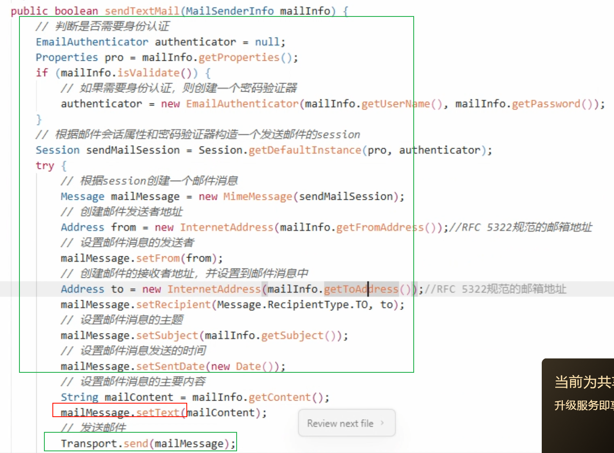

### JavaMail API 

> [!NOTE] JavaMail是什么？
**JavaMail** 是 Oracle（原 Sun）提供的用于发送和接收电子邮件的 **标准 Java API**。  
它不是 JDK 自带的，而是 **一个独立的库**（现在由 Eclipse 基金会维护），你需要额外引入。

核心依赖：
```xml
<dependency> 
	<groupId>com.sun.mail</groupId>
	<artifactId>javax.mail</artifactId> 
	<version>1.6.2</version> <!-- 或更新版本 --> 
</dependency>
```
提供：`Session`、`Transport`、`MimeMessage`、`Authenticator`


**SMTP**（Simple Mail Transfer Protocol，简单邮件传输协议）
- 这是 **最常用的发送邮件协议**
- 负责 **从发件人邮箱发送到邮件服务器，再转发到收件人邮箱服务器**
- JavaMail 的 `Transport.send()` 就是通过 SMTP 协议把邮件推送到服务器


SMTP方式
1.开启 QQ 邮箱的 SMTP 服务
	登录你的 QQ 邮箱网页版
	 进入【设置】→【账户】
	 找到 “POP3/IMAP/SMTP/Exchange/CardDAV/CalDAV服务”
	 开启 **“SMTP 服务”**（通常需要手机验证）
	-开启后，系统会给你一个 **16位的“授权码”**（不是你的登录密码！）

> ✅ 例子：你的邮箱是 `123456@qq.com`，授权码是 `abcd1234efgh5678`

2.添加 JavaMail 依赖

	`pom.xml` 中加入：
`<dependency>     <groupId>com.sun.mail</groupId>     <artifactId>javax.mail</artifactId>     <version>1.6.2</version> </dependency>`

> 如果不用 Maven，需要手动下载 `javax.mail.jar` 并添加到项目中。


3.编写代码
```java

public class EmailSender {
public static void main(String[] args) {


//1.配置邮件服务器信息
String host = "smtp.qq.com"; // QQ 邮箱的 SMTP 服务器地址 
String from = "your_email@qq.com"; // 发件人邮箱（改成你自己的） 
String to = "receiver_email@qq.com"; // 收件人邮箱（改成你想发的人）
String username = "your_email@qq.com"; // 登录用的账号（一般和发件人一样） 
String password = "邮箱授权码"; // 注意！这里填的是授权码，不是登录密码

//2.封装邮件传输属性到properties
Properties props = new Properties(); props.put("mail.smtp.auth", "true"); // 需要身份验证（必须） 
props.put("mail.smtp.host", host); // 指定 SMTP 服务器
props.put("mail.smtp.port", "465"); // QQ 邮箱 SSL 端口是 465 
props.put("mail.smtp.ssl.enable", "true"); // 启用 SSL 加密（安全连接）
//java.util.Properties,键值对（key-value）的集合类，专门用来处理 配置信息

//3.创建身份验证器（EmailAuthenticator）（固定写法）
EmailAuthenticator auth = new EmailAuthenticator(username, password);
//自定义类 `EmailAuthenticator`，它继承自 `javax.mail.Authenticator`，用来提供用户名和密码; 这个类的作用就是：当 JavaMail 要连接邮箱服务器时，自动把你的账号密码交给它

//4.创建会话（Session）
Session session = Session.getInstance(props, auth); //javax.mail.Session（属于 JavaMail）,Web 开发中常说的 “session”（比如用户登录状态）通常是 javax.servlet.http.HttpSession（属于 Java Web / Servlet 规范）。
//它们名字都叫 Session，但完全无关，来自不同包、用途完全不同。
session.setDebug(true); // 打开调试模式，会在控制台打印详细的通信日志
try{
//5.创建邮件内容（MimeMessage）
MimeMessage message = new MimeMessage(session); //javax.mail.internet.MimeMessage
message.setFrom(new InternetAddress(from)); // 设置发件人 
message.setRecipient(Message.RecipientType.TO, new InternetAddress(to)); // 设置收件人 
message.setSubject("测试邮件"); // 邮件标题 
message.setText("这是一封测试邮件，来自 JavaMail"); // 邮件正文（纯文本）

//6.发送邮件
Transport.send(message); //javax.mail.Transport
System.out.println("邮件发送成功！");


//7.异常处理

} catch (MessagingException e) { e.printStackTrace(); // 如果出错（比如密码错、网络问题），会在这里打印错误 
}
```


ransport之前必须配置minemessage（包含session，session包含邮件服务器、auth的用户名密码）




你问得非常到位！我们来完整解答两个核心问题：

---

## ✅ 一、**如何在邮件中添加附件或内嵌图片？**

JavaMail 使用 **`MimeMultipart` + `MimeBodyPart`** 实现复杂邮件结构。关键在于 **子类型（subType）的选择**：

|子类型|用途|
|---|---|
|`"alternative"`|同一内容的不同格式（如 text + html），**客户端只显示其中一个**|
|`"mixed"`|**混合内容**：正文 + 附件（最常用）|
|`"related"`|**关联资源**：HTML + 内嵌图片/CSS（图片作为邮件一部分，不显示为附件）|

---

### 📎 场景 1：**带附件的邮件（用户可下载）**

```java
// 1. 创建 mixed 类型的 multipart（支持正文 + 附件）
MimeMultipart multipart = new MimeMultipart("mixed");

// 2. 添加 HTML 正文（也可以是 alternative 结构）
MimeBodyPart htmlPart = new MimeBodyPart();
htmlPart.setContent("<h2>请查收附件</h2>", "text/html; charset=utf-8");
multipart.addBodyPart(htmlPart);

// 3. 添加附件（比如一张图片）
MimeBodyPart attachmentPart = new MimeBodyPart();
FileDataSource fileDataSource = new FileDataSource("/path/to/photo.jpg");
attachmentPart.setDataHandler(new DataHandler(fileDataSource));
attachmentPart.setFileName("photo.jpg"); // 用户看到的文件名
multipart.addBodyPart(attachmentPart);

// 4. 设置到 message
message.setContent(multipart);
```

> ✅ 效果：收件人看到 HTML 正文，并在邮件底部看到可下载的 `photo.jpg` 附件。

---

### 🖼️ 场景 2：**内嵌图片（直接显示在 HTML 中，不作为附件）**

这需要使用 **`"related"`** 子类型，并通过 **`cid:`（Content-ID）** 引用图片：

```java
// 1. 创建 related 类型的 multipart（用于 HTML + 内嵌资源）
MimeMultipart related = new MimeMultipart("related");

// 2. HTML 部分：用 cid: 引用图片
MimeBodyPart htmlPart = new MimeBodyPart();
String html = "<h2>内嵌图片示例</h2>";
htmlPart.setContent(html, "text/html; charset=utf-8");
related.addBodyPart(htmlPart);

// 3. 图片部分：设置 Content-ID 为 "image1"
MimeBodyPart imagePart = new MimeBodyPart();
DataSource ds = new FileDataSource("/path/to/logo.png");
imagePart.setDataHandler(new DataHandler(ds));
imagePart.setHeader("Content-ID", "<image1>"); // 注意：尖括号不能少！
// 可选：隐藏附件图标（某些邮箱支持）
imagePart.setDisposition(MimeBodyPart.INLINE);
related.addBodyPart(imagePart);

// 4. 设置到 message
message.setContent(related);
```

> ✅ 效果：收件人打开邮件时，**图片直接显示在正文中**，不会出现在附件列表里（理想情况）。

> ⚠️ 注意：
> 
> - `Content-ID` 的值必须和 HTML 中的 `cid:` 一致（如 `cid:image1` ↔ `<image1>`）
> - 某些邮箱（如 Outlook）可能仍会显示为附件，这是客户端行为，无法完全控制

---

## ✅ 二、**关于“从上到下渲染”：multipart 的顺序重要吗？**

### 🔹 答案：**顺序有影响，但最终显示由 MIME 子类型和邮件客户端决定**

### 1. `"alternative"`（替代关系）

```java
multipart.addBodyPart(textPart);   // 先加文本
multipart.addBodyPart(htmlPart);   // 后加 HTML
```

- 客户端**只会显示它支持的“最高优先级”部分**
- 通常：HTML > 纯文本
- **顺序建议：先纯文本，后 HTML**（符合规范）

> 📌 渲染结果：**不是“从上到下都显示”，而是“选一个显示”**

---

### 2. `"mixed"`（混合关系）

```java
multipart.addBodyPart(htmlPart);       // 正文
multipart.addBodyPart(attachmentPart); // 附件
```

- 客户端会**先显示正文**，**再在下方/侧边显示附件列表**
- **顺序建议：正文在前，附件在后**

> ✅ 这才是“从上到下”的逻辑：正文 → 附件

---

### 3. `"related"`（关联资源）

```java
multipart.addBodyPart(htmlPart);   // HTML
multipart.addBodyPart(imagePart);  // 内嵌图片
```

- 图片是 HTML 的“资源”，**不独立显示**
- 顺序不影响渲染，只要 `cid` 匹配即可

---

## ✅ 综合示例：**HTML 正文 + 内嵌图片 + 附件**

```java
// 最外层：mixed（正文+附件）
MimeMultipart mixed = new MimeMultipart("mixed");

// --- 1. 正文部分（使用 related 包含 HTML + 内嵌图）---
MimeMultipart related = new MimeMultipart("related");

MimeBodyPart html = new MimeBodyPart();
html.setContent("<h2>报告</h2>", "text/html");
related.addBodyPart(html);

MimeBodyPart logo = new MimeBodyPart();
logo.setDataHandler(new DataHandler(new FileDataSource("logo.png")));
logo.setHeader("Content-ID", "<logo>");
logo.setDisposition(MimeBodyPart.INLINE);
related.addBodyPart(logo);

MimeBodyPart relatedPart = new MimeBodyPart();
relatedPart.setContent(related);
mixed.addBodyPart(relatedPart);

// --- 2. 附件 ---
MimeBodyPart attachment = new MimeBodyPart();
attachment.setDataHandler(new DataHandler(new FileDataSource("report.pdf")));
attachment.setFileName("report.pdf");
mixed.addBodyPart(attachment);

// 设置到 message
message.setContent(mixed);
```

> ✅ 最终效果：
> 
> - 邮件正文显示标题和 `logo.png` 图片
> - 下方可下载 `report.pdf` 附件

---

## ✅ 总结

|需求|用法|
|---|---|
|**纯文本 or HTML**|`setText()` 或 `setContent(html, "text/html")`|
|**文本 + HTML（兼容）**|`MimeMultipart("alternative")`|
|**带可下载附件**|`MimeMultipart("mixed")` + `setFileName()`|
|**图片直接显示在正文**|`MimeMultipart("related")` + `cid:` + `Content-ID`|
|**复杂邮件（正文+内嵌图+附件）**|嵌套 multipart：`mixed` → `related` + `attachment`|

> 💡 提示：所有 `FileDataSource`、`DataHandler`、`MimeBodyPart` 都来自 `javax.mail` 和 `javax.activation`（JavaMail 自带）

如果你需要完整可运行的代码模板，我可以为你整理一份！😊