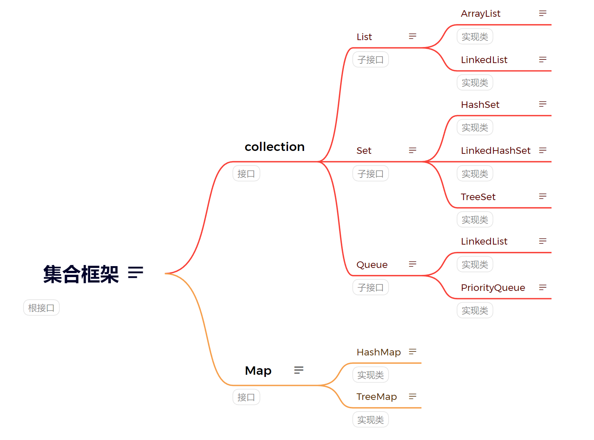

Collections Framework是 Java 提供的一组用于处理数据集合的类和接口

提供数据结构、算法

组成部分：interface接口、calss类、algorithms算法

interface、集合类

集合算法（实际就是结合提供的方法，是特殊方法，一般不用）
	排序
	查找
	反转
	同步

线程安全

> [!NOTE] 
> 多线程同时访问同一份数据时，程序的结果仍然是正确的、可预期的，不会出现数据错乱或异常。

多线程访问就是同时访问，如果访问同一个资源会出现不可预测的结果，这就是不安全的；因为没有对共享数据保护；

变安全的方法：
	加锁synchronized（资源对象）{操作}
	使用线程安全集合
	不共享资源
	使用原子类（读、操作、写是原子化的）

泛型
