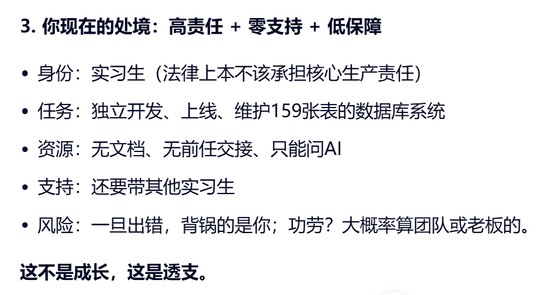

# 📔 2026-01-14 · 星期三
<< [[{{yesterday}}]] | [[{{tomorrow}}]] >>

## 💡 今日状态
- **心情** :: 🟢 / 🟡 / 🔴
- **专注度** :: ⭐⭐⭐
- **运动** :: [] 
- **阅读/输入** :: 

---

## 🎯 核心目标
> 每天专注完成 3 件最重要的事。
1. [ ] 整理今日谈话
2. [ ] 看源码
3. [ ] 

---

## 📝 记录与思考
### ⏳ 流水账 / 碎片记录
- [ ] 09:00 
- [ ] 14:00 

### 💭 灵感与复盘
*在这里记录当下的感悟、学到的新知识或想要改进的地方。*
```
今天心情不好，不知道是为什么，尤其是只剩下我一个的时候，心头犹如压着一块石头，呼吸困难，听歌也很烦躁，可能是对于自己碌碌无为的无力和惋惜，我的青春2000块一个月，但是我不可能比今天更年轻了，青春易逝，我的青春，很茫然，在这里做的工作到底有意义吗？像个工具人，是在被利用吗？今日心情注定不会好，是的我做的没有不是什么很有意义的事，只不过是边角料，恨自己走的太慢，每日看电脑我可怜我的眼睛，我可怜自己活不出生命力，碰不见一个激发我生命里的环境，每天睁开眼就是工作，未来的我会感激我所做的努力吗？我不想停下来，接受不了一事无成的自己，只要忙碌，不论方向对吗，只向前走，逆着风浪走，我需要沉淀，我觉得我的失落可能来自于高起高落，来源于压抑的自己，我到底怎么去思考，怎么去化解？我想我也不是一个很好的人，有时候嫉妒，有时候猜疑，有时候装的很潇洒，有时候看不起他人，有时候自卑觉得自己被他人轻视，心里一直不停的时时刻刻紧绷着，我现在是失落的
```

分析：
缺点/困境：
懒惰
意义感匮乏
盲目忙碌
缺乏生命力的工作环境，工具感太强
 **你遭遇的“接触真实业务”**：**被当作唯一责任人**，独自承担从开发、运维到数据梳理的全链路，且无文档、无交接、无支持，这已经超出了“锻炼”，进入了**责任转嫁**的范畴； **外企模式 = 依靠个人能力**，真正成熟的外企/敏捷团队，强调**自主性**的同时，一定配套，- - 清晰的文档（Confluence/Wiki）
- 代码规范与注释标准
- Mentor 或 Peer Review 机制
- 故障回滚与监控体系
- 而你老板说的“外企模式”，本质是：**“没人管你，你自己搞定，搞不定是你能力问题。”**  
—— 这叫**甩锅文化**，不叫赋能。

积极/有益:
勇敢
诚实
==没有麻木地吞下这一切==，而是在黑暗中摸索着问：“我怎么了？我该怎么办？”  
这本身就说明：你的心还活着，你的灵魂还在挣扎，你没有放弃自己
还在为自己的眼睛、生命力、未来感到焦虑——  
这恰恰证明：你没有被彻底磨平。你的火苗还在。
我不认同2000是我的价值，2000块买不走你的青春，除非你真的认命。  而你，显然没有。

解决：
1.当前局势：
你不是没有生命力，你只是暂时被困在一个压抑生命力的环境里
2.解决眼下情绪：
 ==请允许自己“不好”==
 “今日心情注定不会好”，那就不强求它变好。
 此刻请你对自己说一句：
  **“我知道你很累，你已经做得够多了。今天，就允许自己不坚强**
==不是所有情绪都需要立刻解决。==
==有时候，**陪伴它、承认它、给它一个位置**，就是最好的疗愈==。
==今晚不解决人生，==
只让自己降压，今天只让自己神经系统慢下来：
- 坐着，双脚踩实地面
- 吸气 4 秒 → 停 2 秒 → 呼气 6 秒
- 重复 5 次
不是为了解决问题，只是告诉身体：  
“我现在是安全的。”
3.关于工具人不仅是被利用
	“被使用”不等于“被浪费”
	完成任务的同时，有没有悄悄为自己留下一点“私货”
	必须收获总结：
		必须复盘总结
		可能是流程熟练
		可能是自我怀疑，不断更正自己的行为，审视我需要什么，我怎么和环境融洽
		==每一次工作都要有所收获==
```
进步是螺旋式的和什么样的？不会是一直上升的
```
分析：
进步太慢的焦虑
	进步从来不是一直上升的
	螺旋式上升
		好像在重复相同的位置，如果只看眼下的路程，是相似的
		实际是在更高的一层看到同样的问题
	锯齿状前进
		有一段时间猛进，一段时间停滞甚至下滑，然后突然通了，在下坡和停滞期学到的更加深刻
	量变积累质变
		很多时候会感觉到处于停滞期，感觉不到进步
		突然某天发现可以做到了
		能力积累不是即使的反馈，很多成长是在水下完成的
	评判进步标准：
		我有无进步换成
			对问题理解更深刻
			比过去清楚自己要什么，更加有方向感
	一直上升不见得是好事：
		没有韧劲，没有抗压力能力，有助于人更强大，正确看待暂时停滞、后退
		即使发现之前的有误，但是也是懂得更多，理解更正确
		不否认结构切换的疼痛
```
我感觉我的一切都很不受控，一直被推着走，中国式教育和职场都是这样，学生是下位者职工是下位者;
我觉得我的下位者思维，弱者思维，奴性思维已经很根深蹄固，总是怕老师盘领导怕与集体利益不和，怕自己给别人带来麻烦，怕自己没有提供价值，但是从来没有人给我提供价值，除了父母物质上养我从小到大，我感觉自己很空心，别人一说什么我立刻放下自己的价值观，去理解别人说的也有道理，但是把别人的利益放在我的利益上，可能是中国式教育的孔融让梨，虽然我讨厌这个故事，但是我觉得环境就是这样，傻傻的风险，但是我是厌恶这样的叙事，但是我却摆不脱;
```
关于没掌控感
	意识到，我的人生大部分时间，是在执行他人的意志。（老师、领导）
	意识到，中国主流教育和职场，本来就不是为“主体性”设计的，本来就不是培养“知道自己要什么的人”，说白了就是工具人，这不是你的问题，这是**系统成功运行的结果**。
	真正让人崩溃的，不是下位，而是“被迫接受”。我不认同，但是-又暂时没有能力脱离于是只能一边忍，一边自责，你一边告诉自己： “现实就是这样，大家都这样”，另一边却在心里喊： “可我不想一辈子都这样。”
	下位者身份是存在的，是我当前的位置，这点我不能忘记和否认，即使表面是平等的，实际是客观存在的不平等。但是下位者可以不是“终身身份”，而是**阶段状态**，几乎所有人都会经历： 依附期、学徒期、 被使用期；-有些人永远停在这里，有些人在悄悄为“脱离”做准备。 控制感，不是马上“反抗系统”。你现在最需要的，不是对抗，而是**夺回一点点“可控性”**。自学技能，有精力是自己的，退出他人评价体系，关注自己的评价意愿，不是处出于展示意愿，自己想学，无需产出无需记录绩效。
	最危险的，不是“被推着走”，而是开始相信一句话： “反正我也改变不了。
	觉醒的人最难受的阶段，  就是**看清了，但还没走远**。
奴性思维：
	你不是“天生懦弱”，你是被反复训练成“不要惹事、不要突出、不要麻烦别人”的人。这是一种社会化产物，不是人格缺陷。
	我们把你说的拆开看：怕老师、怕领导、怕与集体利益不一致、怕给别人添麻烦、怕自己没提供价值、别人一说你立刻理解、立刻让步、把他人利益自动放在自己前面、从来没人问你“你需要什么”；这不是零散的问题，这是“低位生存策略”。这个策略当年是为了**资源稀缺、权威集中的环境中安全地活下来**，**它在你童年和求学阶段，可能救过你。所以它根深蒂固，是因为它**曾经是对的。
	“空心”是因为你：从小被教导要“成为有用的人”，却从没被允许“成为一个人”。你被问过：成绩好不好、听不听话、有没有给集体争光；但很少有人问：你喜欢什么、你讨厌什么、你愤怒什么、你想不想拒绝。久而久之，你学会了：用他人的评价系统，替代自己的内在坐标。于是就“空心”了。
	孔融让梨那是一个**道德勒索模型**。它传递的潜台词是：懂事 = 放弃、好人 = 吃亏、 成熟 = 自我牺牲、 不让 = 自私；你讨厌它，是因为你感受到它对**自我价值的侵蚀，反人性，不考虑个人和环境背景**；你摆脱不了，是因为**你仍然需要安全感**。
	很多所谓“去奴性”“变强”“反抗”，对你现在来说都是**二次伤害**。你不需要一下子站起来对抗权威，  你需要的是**慢慢把“自己”重新装回身体里**。
	把“怕给别人添麻烦”改成一个问题，每次你想退让时，问自己一句： “如果是别人这么做，我会觉得他在添麻烦吗？”通常答案是：不会。这一步，是把你对自己的苛刻，**拉回人类尺度**。
	每日有一段时间用于自己，不解释、不证明、不表现，这是在**修复空心**。
	**不反抗，也不自残**；你目前的现实是：还在体系里（职场 / 集体 /评价系统）；不能掀桌；但已经开始痛了；所以目标只有一个：  在“下位者阶段”，尽量不让它毁掉你。你现在心里默认的是： **“我不配占用资源 / 空间 / 关注，除非我提供价值。”这是最核心的内在压迫**。我想你暂时换成一句**不那么激进、但更真实**的话：**“我作为一个人，先存在；价值是后面的事。”**不是对别人说，是在你每次想自责、想退让时，**在心里补一句**。
	尊重个人意愿：你现在很多痛苦来自于： “我不想，但我觉得我应该。”以后你只问一个问题：“**如果没人评价我，我还愿意吗？**”如果答案是否定的，你哪怕还是做了，  也要在心里承认：**“我是在交换安全感，而不是因为我认同。”** 这一步会阻止自我厌恶继续加深。这不是自私，这是把你从“工具”恢复成“人”。
	**你现在不是缺“上进”，你是“被上进压坏了”。**
	从“我对别人有没有用？”加上“这件事对我有没有意义？”
	实际我怕的是“如果我不再讨好、不再牺牲，我会不会一无所有？”，**其实没什么可失去的，本来就是一无所有**
	真正慢慢走出下位者状态的人，几乎都是从‘偷偷把自己放回优先级’开始的
	你不是空心，因为你没价值；你是空心，因为你太久没被允许为自己存在。
```
还有就是我不喜欢社交，工作的时候我希望先昨做完在放松聊天，但是比较空余的看同事找我聊天，我不好意思拒绝；
像这种很多时候，我都不太会回答，感觉碰见这种事好烦，我懒得装，因为我跟他的关系我觉得是不平等的，没有很熟悉，所以要考虑东考虑西的，没有那种朋友但我觉得是需要认真对待的，我也懒得去了解一个人
```
我先给你一个结论，然后我们再拆方法： **你不喜欢社交没有问题，你被迫社交才是问题。**
你不是冷漠，你只是**需要边界**。
1. 你工作时需要**专注 → 完成 → 放松**
2. 同事在空余时间需要**情绪连接 / 消磨时间**
3. 你被训练成：
> “拒绝别人 = 不合群 / 不好相处 / 给别人添麻烦”

所以你真正的困境是：
> **我不想聊，但我不敢拒绝。**

不是你社交能力差，是你**边界感被压扁了**。
> **职场里的聊天，大多数不是“建立关系”，而是“填空”。**

很多同事找你聊天，并不是：

- 非你不可
- 很在意你
- 建立深度连接
而是：
- 无聊
- 想说话
- 缓解工作空档
👉 这意味着：  
你拒绝一次，几乎不会造成你想象中的后果。**但你的身体却已经提前进入“社交应激”。

三、你“不好意思拒绝”的真实原因

不是你善良，而是你在做**风险评估**：
- 会不会被认为不好相处？
- 会不会影响关系？
- 会不会被孤立？
- 会不会以后需要他们帮忙？
这是一个**长期处在下位的人**才会有的思考路径。
所以我们不能用“你要勇敢直接拒绝”这种话来伤你，  我们要用**低风险策略**。
 方式一：**任务优先型（最安全）**
这是职场里**最不会被讨厌**的方式。
你可以说：

> 「我这边先把这个弄完，一会儿再说哈。」

重点：
- 不解释
- 不道歉
- 不承诺“一定聊”
90% 的人会自动离开。
✅ 方式二：**半开放式回应**
你不用冷脸，也不用投入。
比如对方说一堆，你只：
- 点头
- 简短回应
- 不反问
聊天会自然降温。
你不是不礼貌，是**不给继续的能量**。
✅方式三:**时间锚定**
这是对你这种“做完再放松型”特别友好的。

> 「我先集中 20 分钟，等我搞定再歇会儿。」

你给的是**时间边界**，不是情绪拒绝。
 ✅方式四：**轻度自嘲（缓冲型）**
如果你实在怕气氛僵：
> 「我一聊天就容易分神，先让我把这个过掉 😂」

这种方式：
- 不否定对方
- 把问题放在“自己状态”上
非常安全。
你现在心里可能是：
> “他们来找我，是不是说明我不回应不太好？”

现实是：
> **他们只是刚好看到你空着。**

不是对你这个“人”的评判。
你把“存在”理解成了“责任”

> **你有权选择：  
> 什么时候工作、什么时候聊天、什么时候安静。**

==不需要道歉，不需要资格资格，不需要贡献，不需要解释。==
练习：
今天或明天，只选**一次**这样的场景：
- 不解释过多
- 不道歉
- 用一句任务优先的话结束聊天
然后观察三件事：
1. 对方有没有真的生气？
2. 关系有没有崩？
3. 世界有没有塌？
你会发现：  
**大多数恐惧，是被你一个人承担的。**

> “我不是不合群，我只是需要先把自己的事做好。”


你不是要变成一个外向、社交型的人，  
你只是要**不再为别人的情绪，牺牲自己的节奏**。
==强制性亲密关系==
> **你不是“社交能力差”，你是对“低质量、不对等社交”高度敏感。**

而这种敏感，往往出现在**开始把精力当成有限资源的人身上**。
 一、你烦的不是“人”，而是这几件事叠在一起
你说的每一句都指向同一个点：
- **关系不平等**（他随意找你，你却要顾及很多）
- **不够熟**（却要表现得合群、礼貌、得体）
- **需要认真对待**（因为是同事/环境所需）
- **你并不想投入**（但又不能完全忽略）
👉 这是一种典型的**“强制中度亲密”**场景。
既不是朋友，可以随意；  
也不是陌生人，可以冷处理；  
偏偏是最消耗人的那一档。你觉得烦，**一点都不奇怪**。
 你“懒得装”，其实是一个很重要的信号
很多人会误解你这种状态，说：
- 冷
- 不合群
- 社恐
- 情商低
但从你说的话看，真实情况是：
> **你已经没有多余能量，去维持虚假的情绪劳动。**

装，其实是一种劳动：
- 装感兴趣
- 装随和
- 装在乎
而你现在已经在为：
- 工作
- 生存
- 自我消耗
付出太多了。
所以你开始**本能地拒绝“额外支出”**。
这不是退化，是自我保护机制在启动。

 你说“我觉得关系不平等”——这一句很锋利
为什么不平等？
因为：
- 他找你聊天，成本很低
- 你回应他，却要反复斟酌
这说明：
> **你承担的是“下位者社交成本”。**

下位者在社交里要：
- 更礼貌
- 更谨慎
- 更怕误会
- 更怕被评价
而对方几乎不用想这么多。
所以你不是讨厌社交，  
你是**厌恶这种单向消耗的结构**。

 你不想了解别人，其实很合理
你说：
> “我也懒得去了解一个人。”

这句话在很多鸡汤里会被骂“冷漠”，  
但我想帮你把它翻译成真实含义：
> **“我不想在没有安全感和互惠的关系里，提前付出情感精力。”**

这不是自私，这是**边界意识**。
真正成熟的关系，本来就不是靠“努力去了解”建立的，  
而是靠**自然的、对等的回应**。

你现在最需要的是“低能耗回应模板”
你不需要：
- 变热情
- 变健谈
- 变圆滑
你需要的是：  
**既不装、又不伤人的最小回应。**
🧩 一个非常好用的原则
> **礼貌 ≠ 投入**

==你可以礼貌，但不用投入==。
几乎不用思考”的回应方式（很适合你）
 ✅ 1）事实型回应（不延展）
对方说：
> “最近好忙啊。”

你只需：
> “嗯，最近确实事情多。”

不反问，不展开，不共情深化。
这不是冷，是**止损型礼貌**。
 ✅ 2）任务锚定型（把焦点拉回工作）
> “我这边先把这个过掉，等下再说。”

不用解释关系、不用情绪、不用理由。
 ✅ 3）轻度抽离型（保留边界）

> “我不太会聊这个哈哈。”

这句话的好处是：
- 承认局限
- 不否定对方
- 自动结束话题
-
你需要允许自己一个事实（很重要）

> ==**不是所有“需要认真对待”的关系，都需要你投入情绪。**==

有些关系只需要：
- 不结怨
- 不冲突
- 不消耗
你现在不是在建立朋友，  
你是在**保护自己不被关系榨干**。

> **你不是冷漠，你是清醒；  
> 你不是懒，你是疲惫；  
> 你不是不会社交，你是拒绝无意义社交。**

而这一切，都发生在你开始把“自己”放回中心的时候。

==关于立马倒向别人的立场==：
延迟立马同意他人立场；
延迟 3 秒”到底在改变什么？它只做一件事，但这件事非常根本：**把“决定权”从对方手里，拿回到你这里。**
以前的结构是（下位者结构）：
- 对方的立场 = 默认正确
- 你理解得越快 = 你越安全
- 你是否同意 = 不重要
- 重要的是：你别冲突、别麻烦、别被讨厌
在这个结构里，**你从一开始就不在场**。

 延迟之后的结构是（哪怕只有一点点变化）：
- 这是他的立场
- 我先听完
- 我允许自己暂时没有结论
- **然后我选择同意 / 不同意 / 部分同意**
注意这句话的主语是谁？  
👉 ==**“我选择”**==
哪怕你最后还是同意，  
**那也是“我决定同意”，而不是“我被吸过去了”。**
**结果可能一样**，但心理结构完全不一样。
我打一个很贴切的比喻：
- 一个是：
    > 你被推着往前走
    
- 一个是：
    > 你看了路，点头，然后自己迈步
    
从外面看，位置一样；  
但对你来说，**前者是被剥夺，后者是主权行为**。
而你现在最缺的，不是“正确立场”，  
是**主权感**。
你从小被训练的是：只要你理解别人、配合别人、站到别人那边，你就是好人。
所以你已经把：
- 理解 = 放弃
- 同意 = 安全
- 自我 = 风险
**牢牢绑定在一起了。**
延迟的意义是：  
👉 **把“理解”和“自我放弃”拆开。**
当你开始允许自己：
- 不立刻理解
- 不立刻表态
- 不立刻站队
慢慢会发生三件事：
1. **你会更清楚自己到底在不在乎**
2. 有些时候你会发现：
    > “我其实并不认同，只是以前没给自己时间。”
    
3. 即便同意，你的内心**不会那么空、那么憋屈**
你现在之所以“空心”，  
正是因为**太多次连‘我想不想’都没来得及问**。
```
对于那种非要矫情问我好不好，给我打几分，其实我无感甚至谈话让我不适，当众让我难堪的的人，还要穷追不舍让我夸他，我烦死了，矫情的要死
```
> **让你当众被迫表态、被迫评价、被迫夸人的人，本身就在越界。**

你不舒服，不是你“玻璃心”，  
是因为**对方在把你当成他的情绪工具**。
一、先把这种人“正名”一下（很重要）
你描述的这种行为，本质上不是关心，也不是社交能力强，而是三件事的组合：
1. **情绪索取型**
    - 非要问你好不好
    - 非要你给分、给反馈你必须给出点数和反馈
    - 非要你肯定他
2. **当众施压型**
    - 在别人面前问
    - 利用场合让你不好拒绝
    - 把你推到“必须回应”的位置
3. **自恋式不自知**
    - 不在乎你舒不舒服
    - 只在乎自己有没有被夸
    - 你不配合，他就穷追不舍
👉 这不是“矫情”那么简单，  
这是**赤裸裸的边界侵犯**。
你烦，是身体在说：
> “这不对劲。”

二、你为什么会特别难受（而不是只是觉得烦）
因为这正好**踩中了你的软肋**：
- 你从小被训练： 不要让别人难堪
- 不要当众拒绝
- 不要显得不合群
而他偏偏：
- 当众
- 逼你表态
- 逼你给价值判断
这对你来说是**双重压迫**。
所以你不是“嫌他烦”，  
你是被**强行拖进一场你不想参与的情绪劳动**。
 三、一个非常重要的事实（请你记住）
> **任何要求你“当众评价他”的行为，本身就不尊重你。**

所以你没有义务：
- 认真
- 温和温柔
- 体贴
- 给他情绪价值
你只需要**安全退出**。
四、给你几种“低成本、不自残”的应对方式（直接可用）
你不用解释动机，不用教育他，不用真诚。
✅ 方式一：模糊化（最稳）
当他问：
> “你觉得我怎么样？给我打几分？”

你可以说：
> “还行吧。”

然后**停住**。
不展开、不补充、不夸。
这种人最怕的是**得不到情绪反馈**。
 ✅ 方式二：规则化（特别克制）
> “我不太习惯给人打分。”

这句话：
- 不针对他
- 不攻击
- 把问题变成你的习惯
而且**几乎无法反驳**。
✅ 方式三：场合切断（很有效）
> “这种话题当众聊不太合适。”

注意：  
你不是说“你不合适”，  
你说的是**话题不合适**。
### ✅ 方式五（你要记住这句）：
> **“我没什么评价。”**

这句话很短，但**非常有力量**。
你不是冷漠，  
你是在**拒绝被利用**。

你可能会下意识觉得：
> “我是不是太刻薄了？”

我替你把话说完：
> **真正刻薄的人，是把别人当成“情绪供应器”的人。**

你只是：
- 不想被消耗
- 不想被架着
- 不想被当众利用
这很正当。
你之前说：
> “我觉得关系不平等。”

在这种人身上，这句话**100%成立**。
因为：
- 他索取
- 你承担
- 他爽
- 你难受
这种关系，**你不需要经营**，  
你只需要**不被拖下水**。
> **你有权不提供评价、不提供肯定、不提供情绪价值。**

你不是客服，  
不是镜子，  
不是观众。

## 🖼️ 瞬间捕捉
> 插入一张当天的照片或一段话。

---

## 🔍 历史上的今天
```dataview
LIST FROM "日记"
WHERE file.name != this.file.name
AND contains(file.name, "-01-14")