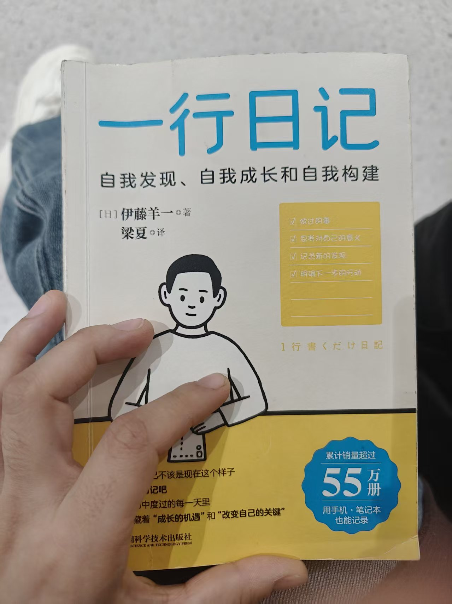
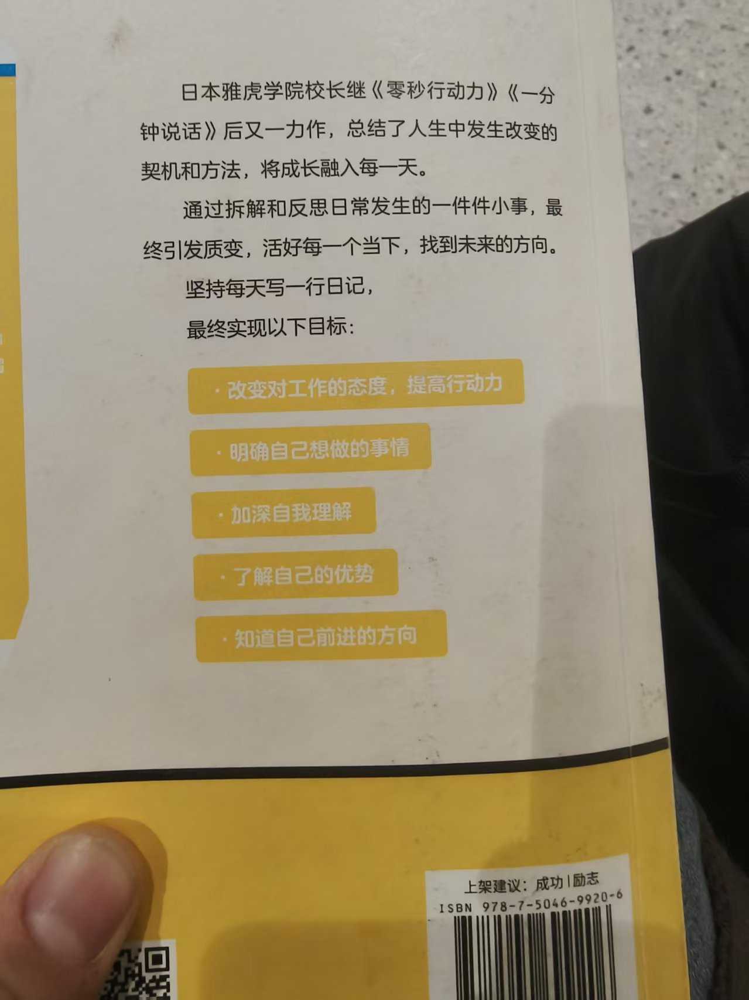

# 📔 2026-01-24 · 星期六
<< [[{{yesterday}}]] | [[{{tomorrow}}]] >>

## 💡 今日状态
- **心情** :: 🟢 / 🟡 / 🔴
- **专注度** :: ⭐⭐⭐
- **运动** :: [] 
- **阅读/输入** :: 

---

## 🎯 核心目标
> 每天专注完成 3 件最重要的事。
1. [ ] 下载图片    15min
2. [ ] 微信接口接入       3h
3. [ ] 阅读代码       3h
4. [ ] 英语         1h
5. [ ] 画画（纸质） 

---

## 📝 一行日记

做过的事
	去西安市图书馆，阅读了《一行日记》 这本书
意义
	感觉挺不错的，觉得用一行日记记录瞬间的感悟、兴奋，一方面日后回忆，一方面复盘，我确实缺少复盘，并且活的很麻木很迷茫，时间有点匆忙，读了一遍·感觉还没读透。


新的发现
	原来我对读书也有兴趣，有点意犹未尽；我觉得自己很多事都是很难开始
- [ ] 14:00 

### 💭 灵感与复盘
*在这里记录当下的感悟、学到的新知识或想要改进的地方。*

---

## 🖼️ 瞬间捕捉
> 插入一张当天的照片或一段话。

---

## 🔍 历史上的今天
```dataview
LIST FROM "日记"
WHERE file.name != this.file.name
AND contains(file.name, "-01-24")