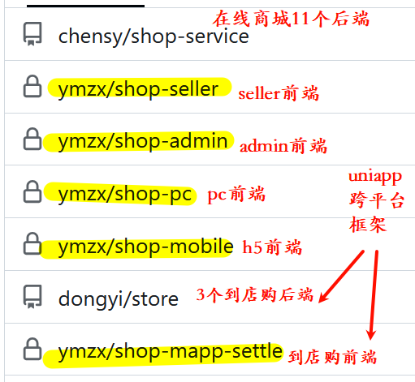

14个服务注册在
	yb03.nacos
提供接口的5个后端：
	YIXIEKEJI-ADMIN-WEB:8081 
		对应shop-admin前端项目
	YIXIEKEJI-PC-WEB:8089
		对应shop-oc前端项目
	YIXIEKEJI-SELLER-WEB:8082
		对应shop-seller前端项目
	YIXIEKEJI-MOBILE-WEB:8810
		对应shop-mobile项目
	SHOP-MOBILE-WEB:8900
		对应shop-mapp-settle项目
前端：（每个域名访问的后端都在本机部署）
	yb04：
		==m.ymzxmall.cn==
			8810
				YIXIEKEJI-MOBILE-WEB
			/home/front/mobile
			访问该域名就是访问
			对应shop-mobile前端项目（直接编译打包）
		==m2.ymzxmall.cn==
			8900
				SHOP-MOBILE-WEB
			/home/front/mobile
			对应shop-mapp-settle前端项目
		==/www.ymzxmall.cn、pc.ymzxmall.cn、ymzxmall.cn==	
			8089
				YIXIEKEJI-PC-WEB
			/home/front/pc
			对应

传统 Vue 项目（只能编译成 web）
	- PC Web
    - H5 Web
	shop-admin、shop-seller、shop-pc
	都是编译 → 放到 Nginx 目录 → 浏览器访问，都是web页面
uni-app 项目（可编译成多种形态）
	shop-mobile、shop-mapp-settle
	原生app
	小程序
	H5
微信四种支付：

| 支付类型        | 中文名               | 适用场景                               | 调用方式                                    | 是否需要用户登录微信    | 配置关键项                             |
| ----------- | ----------------- | ---------------------------------- | --------------------------------------- | ------------- | --------------------------------- |
| JSAPI 支付    | 公众号/小程序/H5（微信内）支付 | 用户在 微信 App 内打开网页 或 公众号菜单跳转 H5      | 前端调 `wx.chooseWXPay` 或 `WeixinJSBridge` | ✅ 必须          | `jsapi授权目录` + 公众号/小程序 AppID 绑定商户号 |
| 小程序支付       | 小程序内支付            | 用户在 微信小程序 中下单                      | 小程序端调 `wx.requestPayment`               | ✅ 必须          | 小程序 AppID 绑定到微信支付商户号              |
| H5 支付（MWEB） | 非微信浏览器支付          | 用户在 Safari / Chrome / 手机浏览器 中访问 H5 | 后端返回 `mweb_url`，前端跳转                    | ⚠️ 需要唤起微信 App | 商户平台配置 H5 支付域名（非 jsapi 目录）        |
| Native 支付   | 扫码支付（PC/线下）       | 用户在 PC 网站 或 收银台 扫码支付               | 后端生成二维码（`code_url`）                     | ❌ 不需要         | 无特殊域名要求，只需商户号                     |